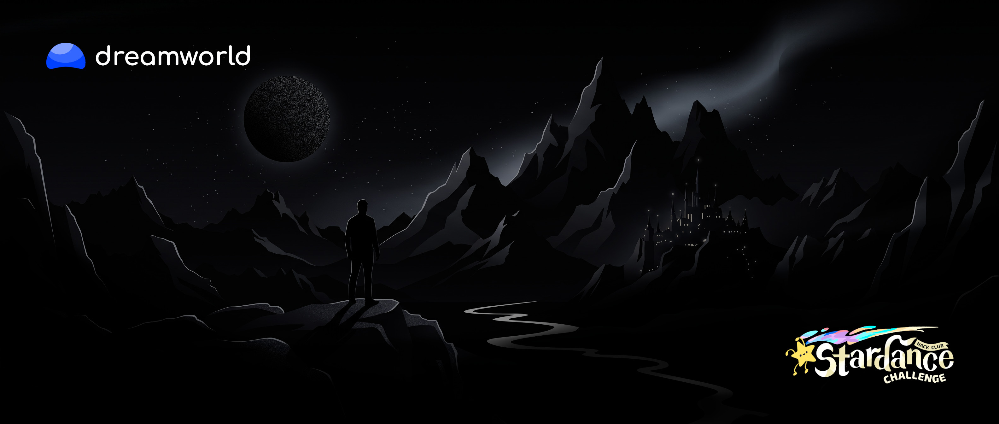
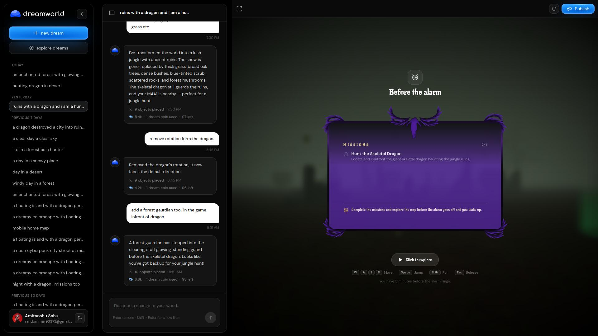
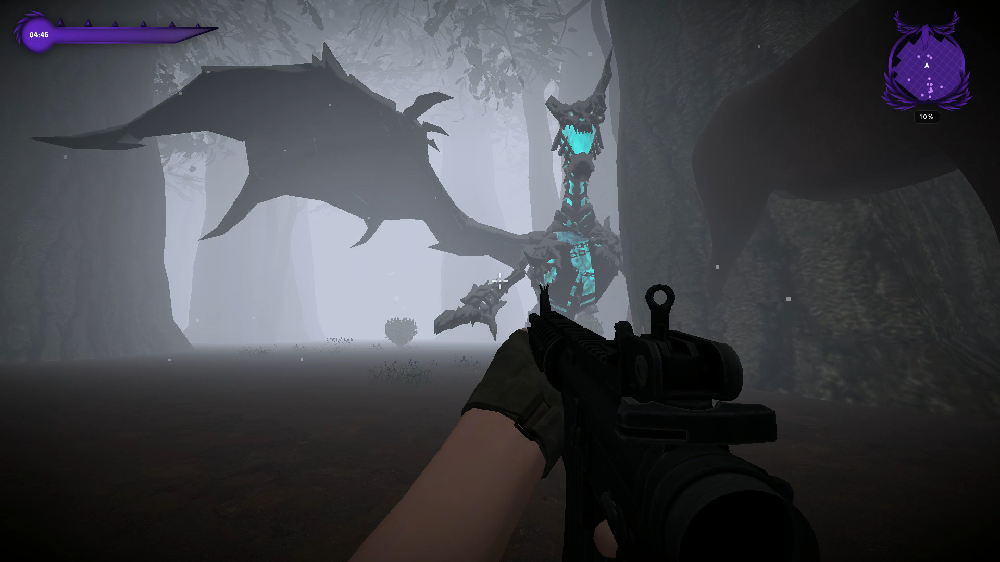
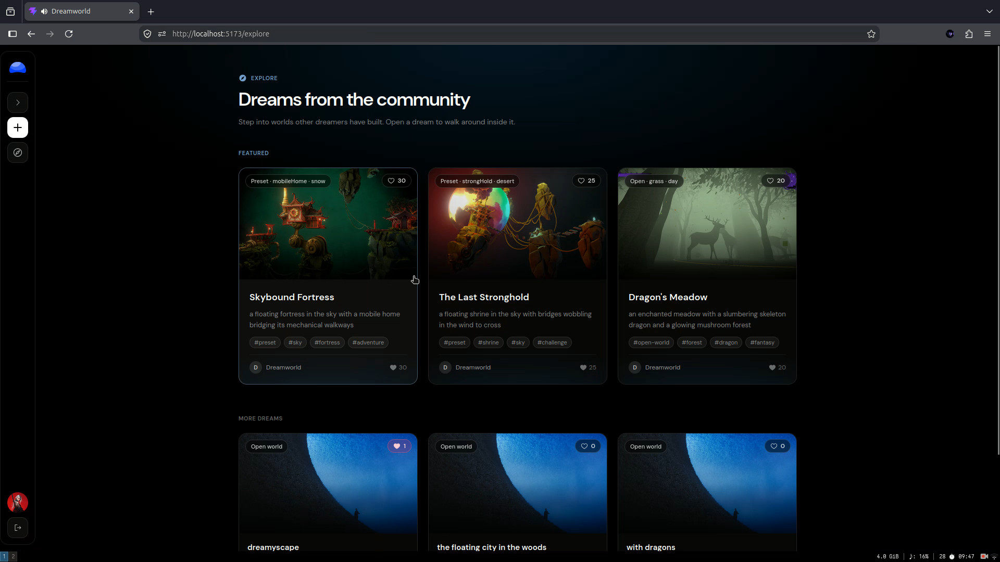
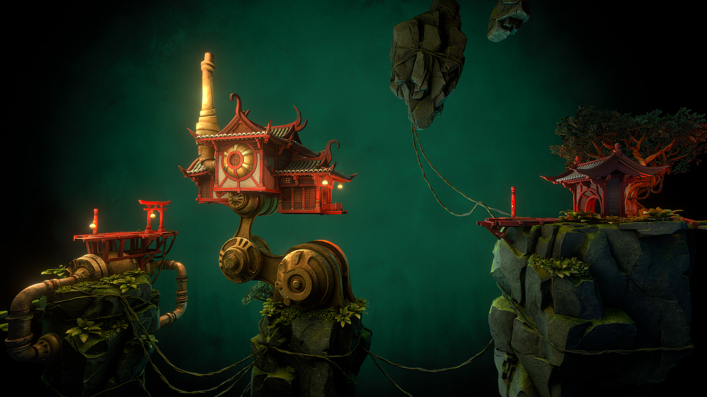
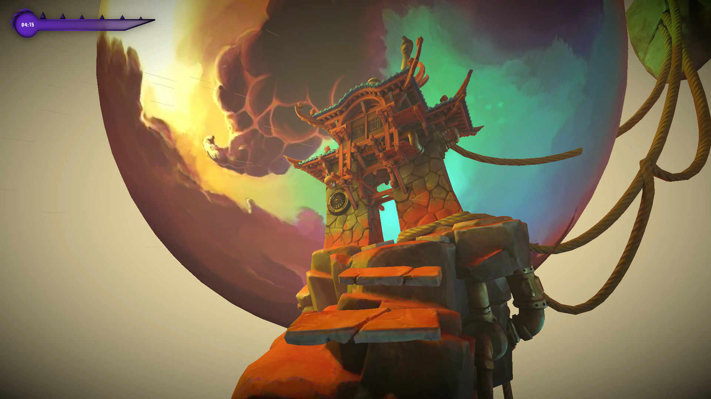

# Dreamworld

  

**Type a dream, wake up inside a playable 3D world. This is vibe dreaming.**

Dreamworld turns your imagination into a place you can walk around in. Describe anything: a floating fortress in the sky, a misty meadow with a slumbering dragon, a neon city at midnight. AI builds the terrain, places the creatures, sets the sky, and drops you in ready to explore. No building, no editor, no game dev skills needed. Dream it and live in it.

Everything connects like a living game. Dream it into existence, reshape it by chatting, pick up a gun and hunt dragons, finish missions before the alarm rings, then publish it for the community to like, explore, and feature.

## Live Demo
🔗 **Try Dreamworld:** <https://dream.cawai.site/>

## Features

### Vibe-dream with an agentic chat
> Don't like something? Just say so. Ask for jungles, broken rocks, new creatures — the agent reshapes the live world while you watch.

  

### Playable worlds: missions, game UI, guns
> These aren't dioramas, they're games. Hunt the skeletal dragon with your M4A1, chase missions against the clock, track it all on a full game HUD.

  

### Publish, get liked, get featured
> Post your dream to the community, collect likes, and earn a featured spot. Or wander the explore page and step inside other dreamers' worlds.

  

### Beautiful worlds on demand
> Floating fortresses, desert strongholds, enchanted forests. Every dream renders as a gorgeous, atmospheric 3D world.

  

  

## Contributing

Found a bug or want a new creature, terrain, or mission type? Open an issue or send a PR.

## Built With

  
  
  
  
  
  
  
  
  
  
  

- **Core Stack:** TypeScript, React, Vite, Tailwind CSS, Bun, Three.js, Rapier, Express, Prisma, PostgreSQL
- **3D & Gameplay:** React Three Fiber with real physics, first-person controls, missions, and a full game HUD.
- **State Management:** Zustand
